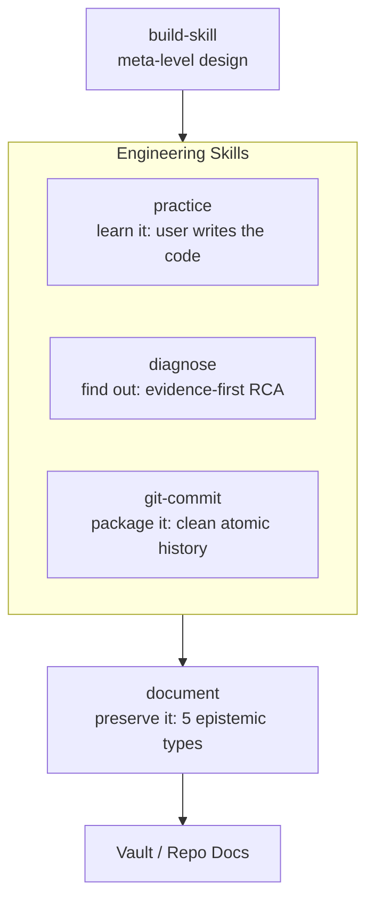

# skills

**Modular, harness-agnostic skills for disciplined pair programming with coding agents.**

A collection of lightweight, single-purpose skills focused on low context overhead (≤50 lines), zero ceremony, and human-approved state transitions. Designed to enforce clean git history, scientific diagnosis, Socratic practice, and durable documentation across any compliant agent platform.

---

## The System Architecture

The skills form an orchestrated pair-programming workflow. `build-skill` governs meta-level skill design. Three core operational skills (`practice`, `diagnose`, `git-commit`) structure day-to-day engineering. `document` evaluates whether insights produced during work warrant durable preservation.



Every skill features an explicit **"Your call"** checkpoint where the agent pauses and asks the human to make critical architectural, diagnostic, and commit decisions with 2-3 concrete options.

---

## Active Skills

### Portable Core (`skills/`)

| Skill | Trigger / Command | Purpose | Length |
| :--- | :--- | :--- | :--- |
| **[`practice`](skills/practice/SKILL.md)** | `/practice [topic]` | Socratic tutoring mode. The user writes all code and drives analysis. Uses graduated assistance and transfer challenges. | 47 lines |
| **[`diagnose`](skills/diagnose/SKILL.md)** | `/diagnose [symptom]` | Evidence-first troubleshooting. Progresses from raw logs to proven root cause and minimal, reversible fixes. | 49 lines |
| **[`git-commit`](skills/git-commit/SKILL.md)** | `/git-commit` | Working-tree inspection, atomic slice decomposition, and Conventional Commit drafting. Human approves every commit. | 54 lines |
| **[`document`](skills/document/SKILL.md)** | `/document` | Second-order knowledge classifier (Discussion, ADR, Plan, Debug Record, Knowledge). User confirms type and provides core insight. | 49 lines |
| **[`build-skill`](skills/build-skill/SKILL.md)** | `/build-skill [topic]` | Interactive design, sizing, authoring, and empirical dogfooding of agent skills. Enforces design review gate before file creation. | 48 lines |

### Brain Extensions (`brain/`)

| Skill | Status | Purpose |
| :--- | :--- | :--- |
| **[`inbox-curation`](brain/inbox-curation/SKILL.md)** | Active | Triages, classifies, and commits incoming notes from Brain's `00-inbox/` into lifecycle directories. |
| **[`commit-logger`](brain/commit-logger/SKILL.md)** | Standby | Immutable Git commit event capture script into Brain ledger (planned consumer of future `journal-builder`). |

---

## Skill Interaction Matrix

| From \ To | Practice | Diagnose | Git Commit | Document | Build Skill |
| :--- | :--- | :--- | :--- | :--- | :--- |
| **Practice** | — | yields for production incidents | learner types the commit | optional handoff on key insights | — |
| **Diagnose** | yields if user wants to find cause | — | hands off to package verified fix | hands off if RCA reveals non-obvious lesson | — |
| **Git Commit** | learner-controlled | packages remediation result | — | delegates if commit warrants deeper doc | — |
| **Document** | consumes practice milestones | consumes RCA findings | packages docs if committed | — | — |
| **Build Skill** | — | — | delegates all commits | delegates all documentation | applies deletion test to itself |

---

## Canonical Flows

1. **Investigation to History**: `diagnose` (verify root cause) -> `git-commit` (atomic slice approval) -> `document` (optional Debug Record / ADR).
2. **Deliberate Practice to Knowledge**: `practice` (solve transfer challenge) -> `document` (author durable knowledge article).
3. **Skill Design Loop**: `build-skill` (approve spec) -> dogfood run -> minimal mechanism refinement.

---

## Installation & Portability

The repository includes an idempotent install script (`install.sh`) supporting both symlink and copy modes:

```bash
# Default install to ~/.gemini/config/skills (symlink mode)
./install.sh

# Verify installation health and detect missing skills
./install.sh check

# Install to custom harness path in copy mode
./install.sh --mode copy --target ~/.custom-agent/skills
```

When run:
- Portable skills and active extensions are linked/copied to the target directory.
- Deprecated or superseded skills are safely relocated to a dated backup directory (`skills.backup-<date>`).
- The global profile `profile/AGENTS.md` is installed as the user's base agent instruction.

---

## Governing Design Rules

1. **One authoritative owner per rule.** If a rule belongs in `AGENTS.md`, do not restate it in every skill.
2. **The deletion test.** If deleting an instruction does not change agent behavior in a meaningful way, delete it.
3. **Plain words over jargon.** Prefer "decision" over "epistemic commitment", "steps" over "state machine".
4. **80 lines maximum for `SKILL.md`.** Deep templates and authoring specs live in `references/`.
5. **Human ownership of critical decisions.** The AI investigates, drafts, and proposes; the human approves the architecture, commits, and destinations.

---

## License

Released into the public domain under the [Unlicense](LICENSE).
