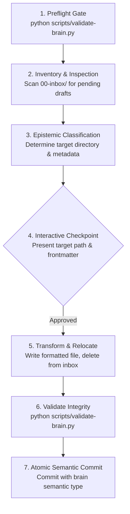

# Inbox Curation & Graph Ingestion

This skill governs the systematic ingestion and curation of unprocessed drafts from `00-inbox/` into the canonical lifecycle directories of the Brain knowledge graph.

---

## 1. Core Invariants

1. **Epistemic Classification over Chronology**: Content is sorted by its epistemic nature, never simply by when it was created:
   - Roadmaps, milestones, phased execution $\to$ `01-plans/<project>/` (`type: plan`)
   - Exploratory debates, trade-offs, architecture options $\to$ `02-discussions/<project>/` (`type: discussion`)
   - Incidents, regressions, root-cause analyses $\to$ `03-records/debug/` (`type: debug`)
   - General knowledge, concepts, languages $\to$ `04-learning/knowledge/` (`type: knowledge`)
   - Practical SOPs, runbooks, operation walkthroughs $\to$ `04-learning/guides/<project>/` (`type: guide`)
2. **The Validation Gate**: A curated document MUST pass `python scripts/validate-brain.py` before any commit is made.
3. **Zero Dangling Drafts**: Once a draft is curated and committed to its destination, the original file in `00-inbox/` must be deleted.
4. **Interactive Checkpoint**: The agent must present the proposed destination, frontmatter, and rationale to the user before relocating files, unless explicitly instructed to process autonomously.
5. **Atomic Commit Boundary**: Each curated document or cohesive bundle must be committed separately with the Brain's semantic commit type (`plan`, `discussion`, `knowledge`, `guide`, `debug`).

---

## 2. Operational Procedure



### Step 1: Preflight Verification
Before touching any files, verify that the repository is currently in a healthy state:
```bash
python scripts/validate-brain.py
```
If the validator fails prior to curation, resolve existing repository issues or alert the user before proceeding.

### Step 2: Inventory & Inspection
Scan `00-inbox/` for files to curate, ignoring `.keep`, `README.md`, system ledgers (`commit-log.csv`), or active scratch notes specified by the user:
- Read the content of the staged draft.
- Identify the project context (e.g. `homelab`, `nekoweb`, `brain`, or global/general).
- Determine whether the draft contains a single concept or multiple mixed concerns that should be decomposed into separate files.

### Step 3: Epistemic Classification & Metadata Preparation
Select the target directory according to the repository's Directory Contracts:

| Content Nature | Target Directory | Frontmatter `type` | Naming Pattern |
| :--- | :--- | :--- | :--- |
| **Phased Roadmap / Blueprint** | `01-plans/<project>/` | `plan` | `<slug>.md` |
| **Exploratory Trade-off / Why** | `02-discussions/<project>/` | `discussion` | `<slug>.md` |
| **Incident Root Cause / Bug** | `03-records/debug/` | `debug` | `YYYY-MM-DD-<slug>.md` |
| **Theoretical / Disciplinary Concept** | `04-learning/knowledge/concepts/` | `knowledge` | `<slug>.md` |
| **Tool / Language Reference** | `04-learning/knowledge/technologies/` | `knowledge` | `<slug>.md` |
| **Engineering Best Practice** | `04-learning/knowledge/methods/` | `knowledge` | `<slug>.md` |
| **Operational SOP / How-to Runbook** | `04-learning/guides/<project>/` | `guide` | `<slug>.md` |

Prepare the compliant YAML frontmatter block matching the destination contract (see Brain's `AGENTS.md` for templates).

### Step 4: Interactive Checkpoint
Present a 4-point curation checkpoint to the user:
1. **Source Draft**: Path in `00-inbox/`.
2. **Proposed Destination**: Target path in vault hierarchy.
3. **Proposed Frontmatter**: YAML block including `type`, `project`, `tags`, etc.
4. **Rationale**: Brief epistemic justification for why this target directory was selected.

*If the user confirms or if operating in approved autonomous mode, proceed to Step 5.*

### Step 5: Transformation, Relocation & Cleanup
1. **Format Content**:
   - Prepend valid YAML frontmatter.
   - Ensure title is an H1 heading matching document purpose.
   - Convert any Obsidian `[[double-bracket]]` links to standard relative Markdown links (`[label](../path.md)`).
   - Ensure external code links use forge Git URLs (never machine-specific `file:///` URIs).
2. **Write Target File**: Write the transformed document to the destination path.
3. **Remove Staging File**: Delete the original file from `00-inbox/`.

### Step 6: Validation Pass
Run repository integrity tests:
```bash
python scripts/validate-brain.py
python scripts/test_validator.py
```
Ensure all checks pass cleanly: frontmatter validation, link resolution, code fences, Mermaid syntax, Ruff linting, and Pyright typing.

### Step 7: Atomic Semantic Commit
Package the curated file using the Brain's semantic commit taxonomy:
- `plan(<project>): <description>`
- `discussion(<project>): <description>`
- `debug(<project>): <description>`
- `knowledge(<topic>): <description>`
- `guide(<project>): <description>`

Commit message must reflect the newly curated document, cleanly isolated from unrelated working-tree changes.
