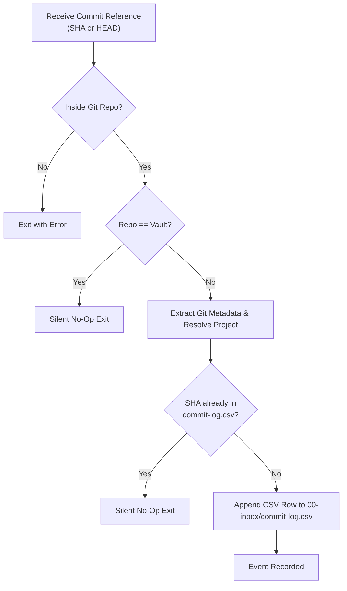

# Commit Logger

Vault extension: captures Git commit events into a configured knowledge-vault ledger (`00-inbox/commit-log.csv`).

Its sole responsibility is **immutable fact capture**. It does not interpret, summarize, or evaluate changes.

---

## 1. Governing Axioms & Invariants

1. **Authoritative Event Identity**:
   > **The full 40-character commit SHA is the authoritative event identity. The CSV row is only its durable representation.**
2. **Pure Fact Capture (Zero Interpretation)**:
   `commit-logger` records only immutable Git metadata. It does **NOT**:
   * Infer, ask for, or fabricate rationale.
   * Derive semantic lineage or retrospective notes.
   * Conduct learning quizzes or interact conversationally with the user.
   * Synthesize or write daily journals (reserved for a future `journal-builder` skill, not built yet).
3. **Lossless Essential Metadata**:
   Captures the complete commit identity and essential Git attributes:
   `committed_at,repository,project,branch,commit_sha,parent_sha,subject`
4. **Authoritative Project Resolution**:
   Resolves the repository directory against the vault's project topology (e.g. `06-projects/`). If no authoritative project mapping exists, preserves the repository name and leaves `project` empty (`""`). Never guesses project associations.
5. **Anti-Recursion Invariant**:
   Commits inside the vault repository itself (e.g. `~/Brain`) are strictly non-loggable by default to prevent recursion. Any automated or hook invocation targeting the vault exits immediately as a no-op. When vault commits represent meaningful engineering progress, passing `--force` (or `--allow-brain`) explicitly captures the commit under project `brain`.
6. **Idempotency Barrier**:
   The full 40-character commit SHA acts as a unique idempotency key. If the SHA already exists in `00-inbox/commit-log.csv`, the event is skipped silently.

---

## 2. Ledger Contract & Storage Schema

* **Target File**: `00-inbox/commit-log.csv` (RFC 4180 compliant)
* **Header**:
  ```csv
  committed_at,repository,project,branch,commit_sha,parent_sha,subject
  ```

### Field Definitions

| Field | Source | Format / Rule | Example |
| :--- | :--- | :--- | :--- |
| `committed_at` | Git committer timestamp | ISO-8601 with timezone (`%cI`) | `2026-10-02T16:42:13-05:00` |
| `repository` | Top-level working directory | Directory basename | `bdinvite` |
| `project` | Vault `06-projects/` mapping | Directory slug if known, else `""` | `bdinvite` |
| `branch` | Current Git branch | Branch ref name (or `detached`) | `feat/gitops` |
| `commit_sha` | Git commit identity | Full 40-character SHA | `a81f3c2e9b7d84f...` |
| `parent_sha` | First parent commit SHA | Full 40-character SHA, or `""` if root | `91bc7de41f2a...` |
| `subject` | Commit subject line | RFC 4180 escaped (double-quoted if needed) | `"validate manifest after pull"` |

---

## 3. Operational Procedure

When invoked following a verified commit (or during catch-up):



### Step 1: Pre-condition & Recursion Check
Inspect the target repository:
```bash
git rev-parse --show-toplevel
```
If the repository root matches the configured vault or the directory name is `Brain`, terminate immediately.

### Step 2: Capture via Deterministic Script
Execute the bundled deterministic capture script:
```bash
bash scripts/log-commit.sh [COMMIT_SHA]   # path relative to this SKILL.md
```
*(If `COMMIT_SHA` is omitted, the script automatically defaults to `HEAD` of the current repository).*

Alternatively, execute the extraction steps directly adhering strictly to RFC 4180 escaping and the schema rules above.

### Step 3: Verification
Inspect `00-inbox/commit-log.csv` to confirm the row exists and adheres to RFC 4180 standards.

---

## 4. Architectural Boundaries & System Role

* **Producer**: `git-commit` invokes `commit-logger` upon verifying the created commit SHA. External or manual commits may trigger `scripts/log-commit.sh` via a Git `post-commit` hook.
* **Storage**: `00-inbox/commit-log.csv` is an append-only raw event ledger. It is exempt from `inbox-curation` triage.
* **Consumer**: `journal-builder` (`/journal`) consumes the accumulated records in `commit-log.csv`, resolves project directories via the active agent profile, checks assessment provenance via journal frontmatters, conducts collaborative reconstruction, and drives the closed assessment loop to synthesize daily journals in `03-records/journal/`.
