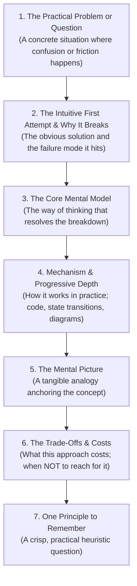

# Knowledge Article Authoring Specification

## Epistemic Role & Core Purpose

A **Knowledge Article** preserves and communicates **generalized, reusable understanding, mental models, and engineering methodologies** extracted from real-world practice. It answers:
> *"How does this concept, technology, or method actually work, and how can a learner think about and apply it?"*

The Knowledge Article is a **learner-to-learner** sharing instrument. Its purpose is to build durable intuition in the reader. It is written for peers working across arbitrary projects, rather than serving as a historical log of one specific session, an authoritative project plan, or a point-in-time architectural decree.

---

## 1. When to Create a Knowledge Article

Create a Knowledge Article when an engineering effort, investigation, practice drill, or architectural synthesis yields **transferable understanding** that meets all three criteria:

1. **Reusability Across Contexts**: The mental model, design pattern, or operational technique applies beyond the immediate repository or subsystem where it was discovered.
2. **Non-Trivial Mental Model**: The subject involves non-obvious trade-offs, subtle failure modes, or conceptual hurdles that standard API docs or cursory tutorials gloss over.
3. **Pedagogical Durability**: The explanation will remain valuable to an engineer months or years later, independent of transient project tasks.

### Target Placement within Knowledge Base or Vault
* **`concepts/`**: Disciplinary and theoretical ideas: data structures, algorithmic paradigms, concurrency models, distributed systems principles (`type: knowledge`).
* **`methods/`**: Reusable engineering practices, workflows, and disciplines: testing strategies, investigative techniques, architectural paradigms, documentation methods (`type: knowledge`).
* **`technologies/`**: Deep dives into tools, runtimes, and languages: environment managers, container engines, frameworks, standard library mechanics (`type: knowledge`).

---

## 2. When NOT to Create a Knowledge Article

To prevent vault bloat and respect epistemic boundaries, do **NOT** create a Knowledge Article for:

* **Session Transcripts & Raw Notes**: Temporary meeting logs, scratch notes, or raw command histories (keep in `00-inbox/` or discard).
* **Project Implementation Blueprints**: Roadmaps, milestone breakdowns, or task tickets for building a specific feature (use **Plan** $\to$ `01-plans/`).
* **Point-in-Time Architectural Commitments**: Decisions selecting a specific stack, framework, or model for a specific repository (use **ADR** $\to$ `03-records/decisions/`).
* **Historical Failure Postmortems**: Empirical diagnosis and logs of a specific broken system or production outage (use **Debug Record** $\to$ `03-records/debug/`).
* **Project Discussions & Trade-offs**: Debates exploring competing directions for a specific system (use **Discussion** $\to$ `02-discussions/`).
* **Runbooks & Operational SOPs**: Step-by-step procedures for administering a specific deployed service (use **Guide** $\to$ `04-learning/guides/`).
* **Shallow API Summaries**: Regurgitating command flags or library cheatsheets that are better found by typing `--help` or reading upstream documentation.

---

## 3. Canonical Fact Ownership & Anti-Overlap Invariants

Knowledge Articles coexist cleanly with other epistemic documents by enforcing strict fact ownership:

| Document Type | Epistemic Question | What It Owns | What the Knowledge Article Must NOT Own |
| :--- | :--- | :--- | :--- |
| **Discussion** | *Why explore this?* | Exploratory inquiries, dilemmas, rejected paths for a project. | Project-specific historical debate or team consensus narrative. |
| **ADR** | *What was decided?* | Formal point-in-time commitments, decision drivers, local forces. | Formal architectural decrees binding a specific repository. |
| **Plan** | *How to build it?* | Phased implementation tasks, task graphs, runbooks, DoD. | Step-by-step execution checklists for deploying project code. |
| **Debug Record** | *What failed & why?* | Empirical triage logs, diagnostic commands, root-cause proof. | Raw incident logs or chronological bug troubleshooting steps. |
| **Knowledge Article** | *How does it work?* | General mental models, failure traps, conceptual mechanics, heuristics. | Specific project state, deployment dates, or transient bugs. |

### Rule of Epistemic Purpose
The same engineering lesson may inform multiple artifacts, but each must serve its native purpose:
* An investigation post-mortem records the raw failure in a **Debug Record** (`03-records/debug/`).
* If the root cause exposed a generalizable diagnostic technique or systems principle, that principle is abstracted into a **Knowledge Article** (`04-learning/knowledge/methods/`), omitting the incident's transient logs.

---

## 4. Voice, Tone, and Reader Model: Side-by-Side Learning

### The Relational Model: Learner $\to$ Another Learner
The author is not an all-knowing expert instructing a novice from above, nor an authority lecturing an audience.

```text
                    ┌─────────────────────┐
                    │     Author          │
                    │  "I learned this"   │
                    └──────────┬──────────┘
                               │
                               │ shares
                               ▼
                    ┌─────────────────────┐
                    │     Reader          │
                    │ "I can learn this"  │
                    └─────────────────────┘
```

### Side-by-Side Learning Voice
Write as a developer who has learned something and is explaining what they learned to another developer who may be learning it too. First-person experience is useful when it exposes a change in understanding, a misconception, or a discovery. Do not adopt an artificial expert persona or imply authority that is unnecessary to the explanation.

Authority comes entirely from the **quality, clarity, and evidence of the explanation**, never from an adopted posture of expertise.

* **Exposing Mental Model Transitions**:
  * `"I initially thought the problem was X. It turned out that X was only a symptom."`
  * `"What clarified this for me was separating the state machine from the prompt text."`
  * `"The mistake I kept making was assuming the model would read ahead without an explicit gate."`
* **Avoiding Authoritative Posing**:
  * Avoid: `"The rookie mistake developers make is X."`
  * Avoid: `"In my years of experience, best practice dictates..."`

### Rhetorical Restraint
Make ideas interesting through the quality of the explanation, not through enthusiasm about the explanation. Avoid exaggerated praise, manufactured surprise, dramatic transitions, motivational language, and phrases whose primary purpose is to make ordinary technical observations sound exciting. If something is surprising, useful, elegant, or important, explain why.

* **Avoid Manufactured Excitement**:
  * Do not write: `"This is an amazing discovery."`
  * Do not write: `"This changes everything."`
  * Do not write: `"Here's where things get really interesting..."`
  * Do not write: `"The beautiful thing about this pattern is..."`
  * Do not write: `"The surprising part is..."`
  * Do not write: `"This is a game changer."`
  * Do not write: `"Once you see this, you can't unsee it."`
* **The Deletion Test for Rhetoric**:
  > **If removing a sentence does not remove information, reasoning, context, or useful perspective, the sentence is merely rhetorical decoration. Delete it.**
* **Genuine Surprise vs. Hype**:
  * If an observation was genuinely counter-intuitive, explain what was expected and what the evidence showed instead:
    * Prefer: `"What surprised me here was that adding more instructions increased the failure rate, because..."`
    * Avoid: `"This technique yields surprisingly powerful results."`

### Explanatory Guidance (Not Manufactured Positivity)
Do not confuse constructive guidance with cheerful or motivational writing.
* Prefer explaining the model, mechanism, and reasoning that lead to a useful approach.
* When an approach fails, explain the failure mode plainly and precisely, using it to motivate the better mental model.
* Do not manufacture optimism, encouragement, or inspirational pep talks.

### Prosaic Precision
* No em-dashes. Rewrite sentences with commas, colons, parentheses, or separate sentences.
* Keep sentences direct and uncluttered.

---

## 5. Learning-Oriented Structure

Our most effective knowledge articles follow a 7-part progression that mirrors how an engineer actually comes to understand a complex idea:



### 1. The Practical Problem or Question
Start with a concrete engineering situation where confusion or friction occurs. Avoid sweeping philosophical introductions. Ground the discussion in real work.

### 2. The Intuitive First Attempt & Why It Breaks
Show what most of us try first when approaching this problem, and why that first attempt breaks down. Point out the specific mechanism causing the failure (e.g. *"We are not spending time managing tasks; we are spending time reorganizing memory"* or *"We are not steering the agent; we are overwhelming its context window"*).

### 3. The Core Mental Model
Introduce the concept or abstraction that resolves the tension. Explain what mental shift is required to see the problem clearly.

### 4. Mechanism & Progressive Depth
Show how the concept operates in practice.
* **Code & Configuration**: Minimal, working examples demonstrating the mechanic.
* **Diagrams**: Mermaid flowcharts or state machines showing boundaries and transitions.
* **Side-by-Side Contrasts**:
  ```markdown
  - Ineffective approach: [Concrete example of what doesn't work]
  - Effective approach: [Concrete example of what does work]
  - Why: [The underlying reason for the difference]
  ```

### 5. The Mental Picture
Provide a clear, tangible analogy that helps the idea stick (e.g. *the scavenger hunt* for linked lists, *the ship's logbook* for ADRs, *the state machine vs. conversation* for skills).

### 6. The Trade-Offs & Costs
Every engineering choice involves a trade-off. An honest article explains what is sacrificed:
* Does this add indirection or initial setup friction?
* Does it require more files or maintenance overhead?
* When is this pattern overkill, and when should someone stick to a simpler approach?

### 7. One Principle to Remember
Conclude with a single reflective heuristic question the reader can ask themselves in their own work to decide whether to apply this lesson.

---

## 6. Frontmatter & Metadata Standards

Knowledge articles adhere to standard YAML frontmatter metadata:

```yaml
---
type: knowledge
status: draft | stable
topics:
  - <primary-domain>
  - <sub-topic>
tags:
  - <search-tag-1>
  - <search-tag-2>
related:
  - ../methods/<related-method>.md
---
```

* `type`: Strictly `knowledge`.
* `status`: `draft` while in development; `stable` once verified and self-contained.
* `topics`: High-level taxonomy branches (e.g. `architecture`, `agent-engineering`, `dsa`, `testing`).
* `tags`: Granular discovery keywords.
* `related`: Relative links to companion methods, concepts, or guides.

---

## 7. Quality & Self-Audit Checklist

Before marking a Knowledge Article `status: stable`, audit it against these criteria:

- [ ] **Side-by-Side Learning Voice**: Does the article read like a learner who worked through a difficult concept carefully and is explaining what they learned to another learner, without adopting unnecessary authority or expertise?
- [ ] **Rhetorical Restraint**: Does every expressive sentence contribute explanation, reasoning, context, or useful perspective? Have all manufactured enthusiasm, dramatic hooks, and ornamental hype been deleted?
- [ ] **Deletion Test Passed**: Can any sentence be removed without losing information, context, or understanding? If yes, prune it.
- [ ] **Explanatory Guidance**: Does the article explain useful models and mechanisms directly, without turning into either a motivational pep talk or a long list of negative bans?
- [ ] **Clear Failure Motivation**: Does the article clearly show why the obvious/intuitive first approach failed before introducing the solution?
- [ ] **Concrete Mechanism**: Are code snippets, diagrams, or state transitions minimal, accurate, and load-bearing?
- [ ] **Explicit Costs**: Are the disadvantages, overhead, and boundary limits of the technique honestly laid out?
- [ ] **One Memorable Heuristic**: Does the article conclude with a single, practical heuristic question?
- [ ] **No Em-Dashes**: Are all sentences written cleanly with commas, colons, or parentheses?
