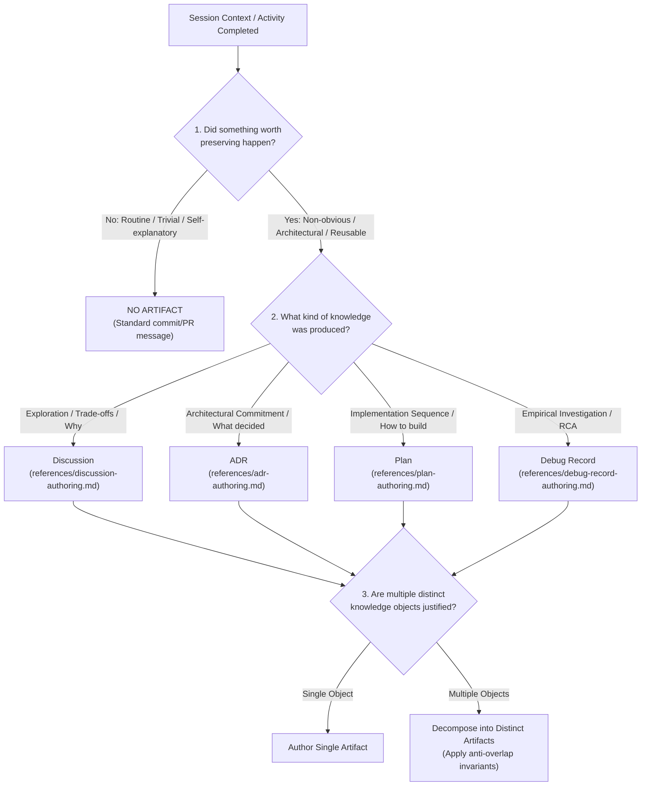

# Documentation Router & Epistemic Governance

This skill acts as a second-order knowledge classifier and router. It inspects session context (investigations, architectural debates, design sessions, tutoring/practice milestones, implementation tasks) to determine whether durable documentation is justified, which epistemic artifact(s) should be produced, and how to prevent overlap or conflicting authority.

---

## 1. The Cardinal Invariant

> **Documentation type is determined by the nature of the knowledge being preserved, not by the activity that produced it.**

* A debugging session discovering an underlying architectural misconception produces a **Discussion** or an **ADR**, not merely a Debug Record.
* An architectural debate that reaches a firm point-in-time consensus produces an **ADR**; if it remains exploratory or consensus is not reached, it remains a **Discussion**.
* An implementation task that uncovers an unaddressed architectural question must pause and route to an **ADR** before proceeding with the **Plan**.
* A routine bug fix or maintenance chore produces **NO ARTIFACT**, regardless of how many files were edited.

---

## 2. The Decision Procedure

When evaluating whether and how to document findings from a session:

### Step 1: Gatekeeping (Anti-Markdown Factory)
Before drafting any document, ask:
* *Did this session yield non-obvious reasoning, surprising failure modes, or architectural insights?*
* *Will an engineer or operator benefit from reading this months later?*
* *If the answer is NO*: **Do not create an artifact.** Record the changes in standard Git commits or code comments.

### Step 2: Epistemic Classification
Map the core knowledge product to its natural epistemic container:

| Knowledge Produced | Epistemic Role | Target Container | Governing Module |
| :--- | :--- | :--- | :--- |
| Explorations, inquiries, trade-offs, pain points, alternatives evaluated, and historical evolution. | **WHY** | `02-discussions/` (`type: discussion`) | [`references/discussion-authoring.md`](./references/discussion-authoring.md) |
| Point-in-time architectural commitments, decision drivers, forces, and accepted trade-offs. | **WHAT was decided** | `03-records/decisions/` (`type: decision`) | [`references/adr-authoring.md`](./references/adr-authoring.md) |
| Authoritative implementation specifications, constraints, phased execution (P0–P5), runbooks, and DoD. | **HOW to build it** | `01-plans/` (`type: plan`) | [`references/plan-authoring.md`](./references/plan-authoring.md) |
| Historical investigation of unexpected system behaviors, regressions, bugs, or anomalies. | **Empirical RCA** | `03-records/debug/` (`type: debug`) | [`references/debug-record-authoring.md`](./references/debug-record-authoring.md) |
| Durable mental models, general engineering methodologies, conceptual deep dives, and transferable patterns. | **UNDERSTANDING** | `04-learning/knowledge/` (`type: knowledge`) | [`references/knowledge-authoring.md`](./references/knowledge-authoring.md) |

### Step 3: Multi-Artifact Decomposition
A rich session may legitimately produce multiple distinct knowledge objects. When justified, decompose them cleanly rather than creating a sprawling hybrid document:
* Example: An investigation that diagnoses a broken pipeline and exposes an architectural limitation can produce a **Debug Record** (recording the RCA) and a **Discussion** (evaluating architectural alternatives).
* Example: An architectural initiative can produce a **Discussion** (recording why the change was needed and what was explored), an **ADR** (locking the chosen model), and a **Plan** (specifying the phased rollout).

---

## 3. Document Relationships & Authority

The relationships below are **possible, not required**. Each artifact is independently valid; none mandates a predecessor or successor.

| From | Relationship | To | Meaning |
| :--- | :--- | :--- | :--- |
| Discussion | may inform | ADR | A resolved exploration can motivate a commitment. |
| ADR | may constrain | Plan | An accepted commitment can bound an implementation spec. |
| Any | cross-references | Any | Any document may link to related records. |
| Debug Record | stands alone | — | Historical investigation; never requires a companion artifact. |

* A Discussion may exist as the only artifact, open or resolved.
* An ADR may be authored directly for a clear commitment, with no prior Discussion.
* A Plan may be authored for a known project, with no prior Discussion or ADR.
* A Debug Record always stands alone as historical memory.

---

## 4. Anti-Overlap Invariants & Fact Ownership

To maintain clarity and prevent contradictory documentation across the vault:

1. **Rule of Epistemic Purpose**:
   The same fact may appear in multiple documents **only when it serves a different epistemic purpose**:
   * *Discussion*: `"The old model coupled software and deployment, which created friction during doc2site development."` (Historical motivation)
   * *ADR*: `"We adopt separate Software and Deployment layers."` (Formal commitment)
   * *Plan*: `"Source repositories contain code; Sites/<app> contains app.yaml and Compose."` (Implementation specification)
   * *Unhealthy duplication*: Copying the same five-paragraph rationale or the same bash execution runbook into all three documents.

2. **Canonical Ownership of Facts**:
   * The **Discussion** owns the exploratory narrative, rejected alternatives, and justification.
   * The **ADR** owns the decision outcome, forces, and accepted trade-offs.
   * The **Plan** owns the implementation sequence, contracts, runbooks, verification gates, and Definition of Done.
   * The **Debug Record** owns the empirical hypothesis testing log, diagnostic commands, and root-cause proof.
   * The **Knowledge Article** owns generalized mental models, failure traps, conceptual mechanics, and transferable engineering methodologies.

3. **Tone and Voice Boundaries**:
   * **Discussion**: Retrospective, narrative, exploratory. Never uses "decision voice" (`"The Decision: ..."`) or imperative commands. Preserves uncertainty and rejected options.
   * **ADR**: Normative, compact (MADR 4.0). Establishes architectural requirements, not implementation procedures or internal schema field names.
   * **Plan**: Technical implementation specification. Uses crisp constraints and invariants without re-arguing rationale. Does not silently introduce new architectural decisions.
   * **Debug Record**: Empirical, factual, evidence-based. Strictly separates observation from inference.

4. **Preservation of History vs. Current Authority**:
   * **ADRs and Plans** represent current architectural commitments and active execution blueprints. When superseded, they remain in the repository marked `superseded`, preserving their historical identity.
   * **Discussions and Debug Records** are permanent historical records. They are never updated to retroactively match subsequent implementation changes.

---

## 5. Authoring Reference Modules

When a specific document type is selected, follow the corresponding authoring specification in `references/`:
* [**Discussion Authoring Specification**](./references/discussion-authoring.md)
* [**ADR (MADR 4.0) Authoring Specification**](./references/adr-authoring.md)
* [**Plan Authoring Specification**](./references/plan-authoring.md)
* [**Debug Record Authoring Specification**](./references/debug-record-authoring.md)
* [**Knowledge Article Authoring Specification**](./references/knowledge-authoring.md)
