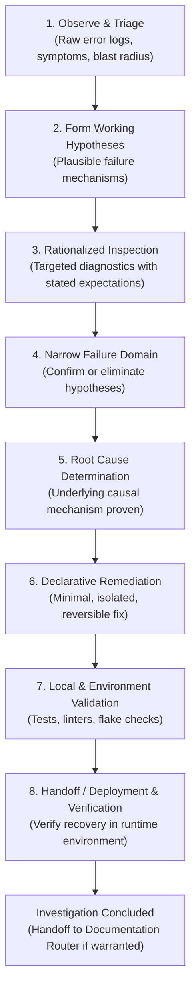

# Engineering Investigation Workflow

This skill establishes the universal engineering investigation lifecycle based on the scientific method. Its purpose is to establish what happened and why using empirical reasoning, stopping cleanly at verified recovery.

---

## 1. The Investigative Lifecycle & Scientific Method

Engineering troubleshooting must follow a disciplined, empirical scientific progression:

### Core Epistemic Principles
* **Evidence Before Hypothesis**: Before formulating causal theories or diving into implementation code, establish sufficient observable evidence (raw logs, error outputs, system traces, or deterministic reproductions where available) to characterize the failure symptom and boundary. Avoid speculative code browsing without grounded empirical observations.
* **Preserve Investigative Reasoning**: Document how the evidence led from the initial observation to the explanation, not merely what final patch fixed the bug.
* **Separate Observation from Inference**: Strictly distinguish what the system reported (raw logs, error outputs, exit codes) from what the operator inferred.
* **Explain Diagnostic Command Rationale**: Before running inspections, be clear on why the command is run, what layer of the stack it tests, and what result supports or refutes the working hypothesis.
* **Traceable Diagnostic Mutations & Cleanup**: Every temporary diagnostic modification (debug logging, environment overrides, test fixtures, database records, probe code, or configuration changes) must have an explicit cleanup boundary and a verification method. Before declaring recovery or proposing commits, verify that all temporary mutations have been completely removed.
* **No Hindsight Bias**: Avoid fabricating a tidy, linear narrative after the fact. Distinguish working hypotheses held during the investigation from insights discovered retrospectively.
* **Proportional Depth**: Scale the depth of investigation to the complexity and learning value of the issue. Do not manufacture complex hypotheses or ceremonial boilerplate for trivial syntax errors or routine typos.
* **Transferable Diagnostic Knowledge**: Surface heuristics, architectural invariants, and debugging techniques that generalize across system boundaries.
* **Sensitive Data Redaction & Zero Leakage**: Diagnostic evidence must be inspected for sensitive values (passwords, API tokens, HMAC keys, authorization headers, database connection strings, personal identifiers) before being surfaced, persisted, or incorporated into an investigation log. Verify credentials via redacted signatures or non-sensitive metadata.

---

## 2. The Interactive Checkpoint Protocol

> **Checkpoint Depth is Proportional to Risk**: For low-complexity investigations (self-evident typos, single-line fixes, isolated test failures with an obvious cause), a single-sentence status note is sufficient. Reserve the full 6-part format for multi-system failures, infrastructure incidents, risky state changes, or any investigation where the blast radius is unclear.

To maintain human-in-the-loop alignment and prevent unchecked autonomous divergence, halt at meaningful investigation transitions rather than stopping after every individual command:

* The failure domain has been materially narrowed.
* An important hypothesis has been confirmed or eliminated.
* A meaningful local configuration or code change has been made.
* Local validation establishes a new state.
* An atomic commit boundary has been reached.
* A production or deployment step is ready for user execution.
* Post-deployment evidence confirms recovery or reveals regressions.

### The 6-Part Checkpoint Format
1. **Current State**: What is empirically known from evidence; what remains uncertain.
2. **Reasoning**: Current working hypothesis, why the evidence supports it, and what alternatives have been eliminated.
3. **Changes**: What has been changed locally, which files are affected, and what invariant the change establishes.
4. **Validation**: What has already been tested, including expected versus actual results.
5. **Next Action**: What should happen next, why it is appropriate, and what evidence is expected.
6. **Recovery**: How the change or deployment can be rolled back if validation fails.

> **Rule**: Present the checkpoint concisely, and **pause before crossing user-controlled state boundaries** (such as committing, merging, pushing, or executing production deployments).

---

## 3. Investigation Completion & Documentation Boundary

Investigation is purely procedural and terminates upon post-deployment verification or recovery.

* Routine maintenance, straightforward typos, and self-explanatory fixes require **no external documentation**—document them normally in Git commit messages or repository-local comments.
* If the investigation yielded architectural insights, unexpected failure modes, false system assumptions dispelled, or reusable operational heuristics, hand off to the global skill **`documentation-router`** to evaluate which, if any, durable documentation artifact is justified.
