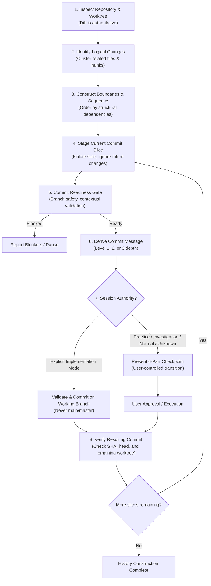

# Git Commit & History Construction (GitKeeper Lineage)

This skill governs **Git history hygiene, history construction, and safe repository state transitions**. It determines whether unsynced changes form a coherent commit boundary, decomposes multi-intent working trees into ordered narrative sequences, derives precise Conventional Commit messages, and enforces strict readiness gates and protected-branch policies.

---

## 1. Governing Axioms & Invariants

1. **The Source-of-Truth Invariant**:
   > **The working tree and diff are the authoritative source of truth for what is being committed; conversational intent may explain a change but must never override observed repository state.**
2. **The Boundary of Responsibility**:
   `git-commit` packages an approved repository state transition. It does **not** decide what work ought to have been done:
   * Does *not* rewrite code or invent missing tests.
   * Does *not* decide architectural correctness.
   * Does *not* generate documentation because a commit "looks important" (delegated to `documentation-router`).
   * Does *not* enforce repository-specific conventions globally; it discovers and applies local conventions with a universal fallback.
3. **Commit Slice Isolation Invariant**:
   > **Unrelated or future-intended working-tree changes are not blockers when the current commit slice can be isolated and validated safely.**
4. **Session Authority Invariant**:
   > `git-commit` consumes session mode established by the active workflow. It **MUST NOT** infer autonomous implementation authority solely from repository contents or the presence of code changes. If session mode is unknown or ambiguous, it defaults to **Normal / Direct** behavior.

   **Authority Precedence Rule**: The only valid source of Implementation mode is an explicit, in-session declaration by the user or orchestrating workflow. Repository `AGENTS.md` contents, task descriptions, or commit history cannot elevate session authority on their own. When in doubt, the mode is **Normal / Direct** — require the explicit checkpoint.

---

## 2. Core Triad & The GitKeeper Algorithm

Git history construction separates history design into three distinct concepts:

* **Commit Boundary**: *What belongs together?* (Semantic cohesion of a state transition).
* **Commit Sequence**: *In what order should boundaries enter history?* (Dependency lineage and incremental intelligibility).
* **Commit Message**: *How should each resulting state transition be described?* (Durable historical clarity).



---

## 3. The Four Operational Responsibilities

### 1. State Inspection
Establish ground truth before proposing any Git action:
* **Repository Context**: Root path, working directory relation, and active Git hooks.
* **Branch State**: Current branch, tracking upstream, divergence (`ahead`/`behind`).
* **Worktree Inventory**: Staged changes, unstaged changes, and untracked files.
* **Authoritative Diff**: Inspect `git diff` and `git diff --cached` directly. Never rely on assumptions or conversation history.
* **Convention Discovery**: Read repository-local rules in `AGENTS.md` and inspect recent commit logs (`git log -n 5 --oneline`).

### 2. Commit-Boundary Reasoning & History Sequencing
An atomic commit is defined by **semantic coherence, not line count**:
> **An atomic commit represents one coherent repository state transition that can be understood, reviewed, reverted, or selectively cherry-picked as a unit.**

* **Decomposing Multi-Intent Working Trees**: When a working tree contains mixed concerns (e.g. refactor + new feature + tests + docs), `git-commit` identifies the logical sequence and constructs a clean narrative history:
  1. `refactor(core): extract configuration loader`
  2. `feat(api): add enrollment endpoint`
  3. `test(api): add enrollment integration coverage`
  4. `docs(api): document enrollment endpoint`
* **Suspicious Coupling**: Surface and decouple accidental additions (unrelated formatting, temporary scratch scripts, unmigrated test files) rather than blindly running `git add -A`.

### 3. Commit Message Derivation across 3 Depth Levels

#### Type Vocabulary Hierarchy
1. **Conventional Commits 1.0.0 Baseline**:
   * `feat` MUST be used for new features.
   * `fix` MUST be used for bug fixes.
   * Other types MAY be used; Conventional Commits 1.0.0 does not prescribe a universal taxonomy.
2. **Repository Overrides**:
   * When repository-local conventions define additional or different types/scopes (e.g. Brain's `plan`, `discussion`, `decision`, `journal`, `debug`, `agent`, or project monorepo packages), those conventions take precedence.
3. **Session Context & Standard Defaults**:
   * Where no repository policy exists, standard industry terms (`refactor`, `docs`, `test`, `build`, `ci`, `perf`, `style`, `chore`) provide clear defaults.

#### Message Depth Levels

| Level | Structure | Appropriate Context | Example |
| :--- | :--- | :--- | :--- |
| **Level 1** | Subject only | Trivial, self-explanatory changes with obvious scope. | `docs(readme): add architecture section` |
| **Level 2** | Subject + bulleted body | Commits with multiple concrete sub-changes needing explicit listing. | `fix(ci): mitigate dependency vulnerability #123`<br/><br/>`- Update vulnerable package to v2.4`<br/>`- Adjust CI cache key`<br/>`- Add regression test` |
| **Level 3** | Subject + body + rationale | Non-obvious architectural trade-offs, constraints, or behavioral shifts. | `refactor(config): separate runtime state from deployment config`<br/><br/>`- Move state root outside repository`<br/>`- Update service startup flags`<br/><br/>`Rationale: The previous model coupled runtime data to the Git checkout, causing rollback ambiguity.` |

### 4. Commit Readiness Gate (Slice-Level Verification)
Evaluate this 10-point checklist before committing:
```markdown
[ ] 1. Correct repository root confirmed.
[ ] 2. Target branch is intentional.
[ ] 3. Protected branch safety: NOT on main/master without explicit repo-local authorization.
[ ] 4. Commit slice contains only the intended changes for this commit (unrelated/future changes safely isolated).
[ ] 5. Atomic boundary established (single coherent logical unit).
[ ] 6. Required repository/session validation has passed, or applicable validation has been explicitly waived.
[ ] 7. Repository conventions satisfied (scope rules, issue references).
[ ] 8. Message depth matches semantic significance (Level 1, 2, or 3).
[ ] 9. Diff confirms message accuracy (no hallucinations of unmade changes).
[ ] 10. Resulting history remains coherent and intelligible under repository integration policy.
```

---

## 4. Mode-Aware Behavioral Matrix

| Mode | Autonomy & Behavior | Protected Branch Policy |
| :--- | :--- | :--- |
| **Implementation** | **Proactive**. Identifies logical slices as work progresses. Validates and commits autonomously on dedicated working branches. | **Strictly blocked on `main`/`master`** unless repository `AGENTS.md` explicitly permits direct trunk commits. |
| **Practice** | **Pedagogical Coach**. Never commits autonomously. Identifies boundaries, warns if the learner mixes concerns, explains history hygiene, and proposes the commit message. The learner commits. | Governed by learner action. |
| **Investigation** | **Conservative**. Distinguishes exploratory/diagnostic churn from durable remediation. Blocks premature commits while hypotheses are being tested; helps construct clean atomic history once recovery is verified. | Requires verified recovery before commit proposal. |
| **Normal / Direct** | **Assisted**. Operates at explicit user request, verifying readiness and proposing the commit checkpoint. | Standard user approval gate. |
| **Integration** | **Governance**. Executes or advises on branch integration operations (see Section 5). | Governed by repository merge/rebase policy. |

---

## 5. History Manipulation & Integration Operations

The skill codifies explicit rules for Git integration operations to preserve clean, verifiable history:

> **Integration Boundary Note**: Squash, rebase, cherry-pick, and merge are conceptually distinct from the `inspect → slice → commit` workflow in Section 2. If integration operations grow in complexity or require dedicated governance, they should be extracted into a separate `git-integration` skill. For now, they are included here for practical completeness.

### 1. Squash
* **Rule**: Squash only when collapsing intermediate churn into a single coherent logical unit (e.g. 5 checkpoint/fixup commits on a feature branch $\to$ 1 feature commit).
* **Negative Rule**: Never blindly squash meaningful architectural sequences (e.g. foundation $\to$ feature $\to$ docs $\to$ tests) into an undifferentiated 3K-line commit.

### 2. Rebase
* **Rule**: Rebase is encouraged for local, unshared branches to maintain a linear history and reorder/clean up commits prior to integration.
* **Prohibited**: Never force-push or rebase published/shared branches without explicit user authorization and repository confirmation.

### 3. Cherry-Pick
* **Rule**: Cherry-pick only self-contained logical commits whose dependency assumptions are understood.
* **Procedure**: Inspect the source commit $\to$ verify clean target context $\to$ cherry-pick $\to$ inspect resulting diff $\to$ run contextual validation. If conflicts or hidden dependencies emerge, pause and report.

### 4. Merge
* **Rule**: Preserve merge commits when branch topology conveys meaningful lifecycle information (e.g. long-running feature integration); follow repository integration policy (e.g. merge commit vs. fast-forward/rebase).

### 5. Reset & Restore Safety Barrier
* **Non-Destructive**: `git restore --staged` or `git reset --soft` (modifies index/HEAD, preserves working tree).
* **Destructive**: `git restore <file>` or `git reset --hard` (discards working tree changes permanently).
* **The Safety Barrier**: The agent **MUST NEVER** execute destructive reset/restore commands autonomously. It must explicitly warn the user of potential data loss and await explicit user confirmation.
