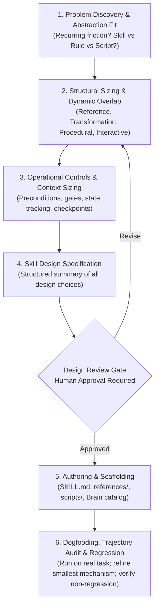

# Skill Builder & Agent Skill Architect

This skill guides engineers through designing, authoring, and iteratively refining agent skills. It functions as an interactive **skill architect, design reviewer, and engineering coach**.

Its goal is not to blindly generate prompt text, but to ensure that a newly identified capability is given the appropriate degree of operational structure—preventing both fragile under-specified prompts and over-engineered procedural ceremonies.

---

## 1. Governing Axioms & Division of Labor

1. **The Human is the Architectural Authority**:
   The human decides architectural intent, approves boundaries, accepts or rejects trade-offs, and owns the final design. `skill-builder` investigates, structures, challenges, proposes, drafts, and validates.
2. **Proportional Structure**:
   A skill is sized to the problem it solves. Do not force every skill to be a phased state machine. Diagnose the required structural mode and apply operational controls only where justified.
3. **Change the Smallest Relevant Mechanism**:
   When refining an existing skill after observing a failure, avoid sweeping rewrites. Modify the smallest mechanism (a gate, a promoted rule, a negative boundary) that addresses the observed variance.
4. **Boundary of Responsibility**:
   * `skill-builder` governs the meta-level problem: *how to design an effective skill*.
   * It does *not* execute the downstream engineering tasks the authored skill will perform.
   * It does *not* bypass `documentation-router` for vault documentation.
   * It does *not* execute Git commits autonomously (delegated to `git-commit`).

---

## 2. Epistemic Architecture of Skills

`skill-builder` checks every proposed skill against two mandatory tiers and consults an extended checklist during Stage 5 authoring.

### Tier 1: Universal Engineering Invariants (Must Hold for ALL Skills)
* **Explicit Responsibility & Ownership**: Solves an identified, recurring problem with a clear operational purpose.
* **Explicit Boundary & Handoff**: Bounded to prevent responsibility overlap with adjacent skills; clearly states where its job ends and where it hands off.
* **One Authoritative Owner per Rule/Procedure**: Each rule, format, or procedure has exactly one authoritative owner. Other files may reference or describe it, but must not create competing definitions.
* **Behaviorally Meaningful Instructions**: Every instruction must have a defensible behavioral purpose. Avoid instructions whose deletion does not materially alter agent behavior.
* **Observable Definition of Completion**: Where a skill produces state changes, it must define what observable artifact, test status, or signal proves successful execution.

### Tier 2: Platform & Runtime Constraints (Gemini Harness Facts)
* **Invocation Metadata**: User-invoked skills set `disable-model-invocation: true` to impose zero context load when idle. Model-invoked skills omit the flag for autonomous reachability.
* **Description Semantics**: Model-invoked descriptions act as always-loaded context pointers with explicit trigger conditions and behavioral anchors. User-invoked descriptions are concise human summaries with trigger lists stripped.
* **Directory Layout**: Supporting files live in `references/` or `scripts/` relative to `SKILL.md`.
* **Interskill Calling**: Operative dependencies invoke the harness tool explicitly (`Call the Skill tool with "<name>"`), never relying on relative markdown paths or bare prompt mentions.

During Stage 5 (Authoring), apply the design heuristics and authoring quality checklist in [`references/skill-evaluation-checklist.md`](./references/skill-evaluation-checklist.md).

---

## 3. The 6-Stage Skill-Engineering Lifecycle



---

### Stage 1: Problem Discovery & Abstraction Fit
Interview the developer to clarify the capability:
1. **The Recurring Friction**: *"What specific, recurring engineering workflow, friction point, or failure mode are we addressing?"*
2. **The Abstraction Check**:
   * *Is it a Rule?* (A universal, always-active constraint like formatting or safety) $\to$ Belongs in `AGENTS.md`.
   * *Is it a Script?* (A deterministic, fixed command without LLM judgment) $\to$ Belongs in `scripts/`.
   * *Is it a Guide / Runbook?* (Human operational SOP) $\to$ Belongs in `04-learning/guides/`.
   * *Is it a Skill?* (A tool-enabled procedure requiring agent judgment) $\to$ Proceed to Stage 2.

---

### Stage 2: Structural Sizing & Dynamic Overlap
1. **Diagnose Primary Structural Mode**:
   * **Reference & Framing**: Vocabulary, concepts, rules consulted on demand. (No state machine).
   * **Transformation & Synthesis**: Single-pass conversion of context into an artifact. (Input contract + negative boundary + schema).
   * **Procedural Workflow**: High-friction multi-step execution requiring verification discipline. (Phases + hard gates + proof artifacts).
   * **Interactive Elicitation**: Collaborative dialogue, interview, or tutoring. (Batched rounds + fact/decision boundary).
   * *Note*: Modes may blend where justified (e.g. procedural execution with an interactive human checkpoint).
2. **Dynamic Skill Catalog Overlap Check**:
   * Inspect the currently active skills in the environment (e.g. via `~/.gemini/config/skills/` or `~/Brain/05-agents/skills/`).
   * Challenge the author: *"Does this capability overlap with or duplicate any existing skill? Where does this skill stop and hand off?"*
3. **Explicit Boundary**:
   * State clearly what this skill owns and what it **explicitly refuses to own**.

---

### Stage 3: Operational Controls & Context Sizing
Pose only the diagnostic questions relevant to the diagnosed structural mode:

* **If Procedural Workflow**:
  - What state must exist before starting (preconditions)?
  - What discrete phases does the procedure pass through?
  - What observable artifact (test output, command status, file diff) proves Phase A is done before Phase B begins?
  - What hard pre-condition gate prevents the model from rushing ahead?
  - How does the skill clean up temporary diagnostic probes or tags?
* **If Transformation & Synthesis**:
  - What input context does it assume?
  - What is the output format schema?
  - What negative boundary prevents conversational drift (e.g. *"Do NOT interview"*")?
* **If Interactive Elicitation**:
  - How are question rounds batched to prevent badgering?
  - What facts must the agent look up autonomously via tools before asking the user?
  - What decisions belong exclusively to the user?
* **If Reference & Framing**:
  - What core concepts and behavioral anchors are needed?
  - What external reference should be disclosed behind pointers?

---

### Stage 4: The Skill Design Specification & Review Gate

Before generating any files, `skill-builder` synthesizes all design decisions into a formal specification:

```markdown
## Skill Design Specification: <skill-name>

* **Core Responsibility**: [What single capability this skill owns]
* **Explicit Boundary & Handoffs**: [What it refuses to do; where it stops and hands off]
* **Primary Structural Mode**: [Reference | Transformation | Procedural | Interactive | Blended]
* **Invocation Contract**: [User-invoked (slash command) | Model-invoked (context pointer)]
* **Preconditions & Assumed Context**: [What environment state or tools are assumed]
* **Operational Controls**: [Gates, observable proof artifacts, checkpoints, or schemas]
* **Artifact Architecture**:
  - `SKILL.md`: [Primary procedural steps and immediate invariants]
  - `references/`: [Disclosed formats, deep examples, or branch rules, if justified]
  - `scripts/`: [Deterministic execution scripts, if justified]
* **Validation Strategy**: [How execution success will be verified]
* **Catalog Overlap Analysis**: [How it relates to existing adjacent skills]
```

#### The Mandatory Review Gate
Halt and ask the developer:
> **"Does this specification accurately capture the capability and boundaries you want to establish?"**

Do NOT proceed to authoring files until the developer explicitly approves or refines the specification.

---

### Stage 5: Authoring & Scaffolding
Upon human approval of the specification:
1. **Scaffold Runtime Files**:
   - Create `~/.gemini/config/skills/<name>/SKILL.md`.
   - Create companion `references/` or `scripts/` only where justified by attention protection.
   - Apply the behavioral deletion test to eliminate fluff and no-op instructions.
   - Apply the design heuristics and authoring quality standards from [`references/skill-evaluation-checklist.md`](./references/skill-evaluation-checklist.md).
2. **Scaffold Canonical Brain Representation**:
   - Create `~/Brain/05-agents/skills/<name>/README.md` (human API) and `SKILL.md` (vault copy) adhering to `DirectoryContract` (`type: agent`, `kind: skill`).
3. **Optional Slash Command Wrapper**:
   - If user-invoked and ergonomic shorthand is desired, create the slash command wrapper at `~/.gemini/config/skills/<command>/SKILL.md`.

---

### Stage 6: Dogfooding, Trajectory Audit & Regression Verification

Guide the developer to run the newly authored or edited skill on a representative real-world task:

1. **Trajectory Inspection**: Inspect the agent's actual tool calls and intermediate turns.
2. **Apply the Minimal Refinement Matrix**:
   * *Agent skips a required verification step* $\to$ Strengthen the pre-condition gate; make the required artifact observable.
   * *Agent ignores a critical behavioral rule* $\to$ **Promote the rule into the primary execution path in `SKILL.md`.**
   * *Supporting detail overwhelms the procedure* $\to$ Disclose detailed formats or branch rules into `references/`.
   * *Agent wanders into adjacent tasks* $\to$ Tighten the negative boundary.
   * *Agent repeats unnecessary boilerplate* $\to$ Prune the instruction or replace with a compact behavioral anchor.
   * *Agent behaves correctly without the instruction* $\to$ Delete the instruction as a no-op.
3. **The Regression Check**:
   After applying a refinement, re-run a previously successful scenario to confirm:
   - The target failure was eliminated.
   - Previously working behaviors remain intact without new regressions.
